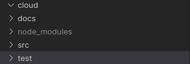
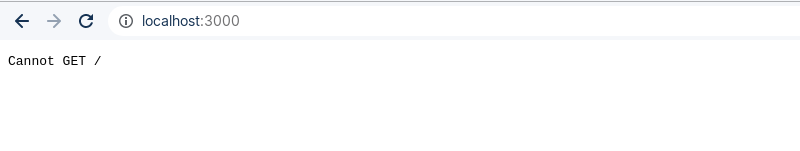

# __Stupid Filesystem operations__

## __Get start__
This tutorial assumes that you have a Docker and Docker Compose installed on your computer.

1. Create the __cloud__ empty directory in the application root path like the image.



2. Run the command in your terminal to install dependencies and start the web server.
```sh
docker-compose up
```

3. Open your browser and access http://localhost:3000.



4. Ok. All application routes use the GET http method for ease the proccess. So you can interact with the application using your browser even.

5. Below you can see all the application routes and some rules. 

- The `:variable` must be change. 
- The unique special character allowed in filenames is `-`. Numbers and spaces also are not allowed.
- The extensions allowed are `.txt`, `.html`, `.md`, `.json`, `.yaml` and `.xml`,
- The permissions must be an array and accept `"x"`, `"r"`, `"w"`, `""` and `[]`. Example: `[]`, `[""]`, `["r", "w", "x"]`.

### __Permission table__
 - Combine the permissions to build the standard POSIX.

|Permission|Description|
|:---|:---|
|[]|No permission|
|[""]|No permission|
|["r"]|Read only permission|
|["w"]|Write only permission|
|["x"]|Execute only permission|

### __Routes table__
|Route|Description|
|:---|:---|
|/api/v1/create-file/:filename|Create file|
|/api/v1/remove-file/:filename|Remove file|
|/api/v1/update-filename/:oldFilename/:newFilename|Update file|
|/api/v1/copy-file/:filename|Copy file|
|/api/v1/set-file-permission/:filename/:ownerPermissions/:groupPermissions/:outherPermissions|Set file permission|
|/api/v1/show-files|Show all files|